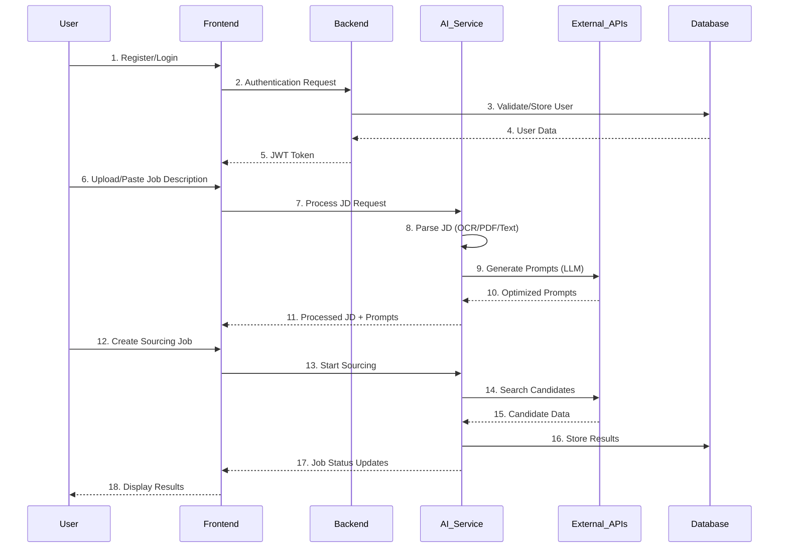

# 🎯 Scoutly - Intelligent Talent Sourcing Platform

<div align="center">


[](https://python.org)
[](https://nodejs.org)
[](https://reactjs.org)
[](https://fastapi.tiangolo.com)
[](https://mongodb.com)

**A multi-agent based intelligent candidate searching and sourcing platform that revolutionizes talent acquisition through AI-powered job description processing and automated candidate discovery.**

</div>

## 🌟 Overview

Scoutly is an advanced talent sourcing platform that leverages artificial intelligence to streamline the recruitment process. It automatically processes job descriptions, generates optimized search prompts, and sources candidates from multiple platforms including LinkedIn and GitHub.

### 🏗️ Architecture Overview


### 🔄 Workflow Diagram



## ✨ Key Features

### 🤖 AI-Powered Processing
- **Multi-format JD Processing**: Supports text, PDF, and image job descriptions
- **OCR Integration**: Advanced text extraction from images using Tesseract
- **LLM-Powered Prompt Generation**: Creates optimized search queries using Groq API
- **Intelligent Parsing**: Extracts key requirements, skills, and qualifications

### 🔍 Advanced Sourcing
- **Multi-platform Search**: LinkedIn, GitHub, and web search integration
- **Real-time Processing**: Background job processing with status monitoring
- **Profile Ranking**: AI-powered candidate scoring and ranking
- **Vector Database**: Efficient storage and retrieval of candidate profiles

### 🛡️ Security & Authentication
- **JWT-based Authentication**: Secure user sessions with 7-day expiry
- **Password Encryption**: bcrypt hashing for secure password storage
- **Protected Routes**: Middleware-based route protection
- **CORS Configuration**: Secure cross-origin resource sharing

### 🎨 Modern UI/UX
- **Responsive Design**: Tailwind CSS for mobile-first design
- **Real-time Updates**: Live status monitoring and job progress
- **Drag & Drop**: Intuitive file upload interface
- **Error Handling**: Comprehensive error states and user feedback

## 🚀 Quick Start

### Prerequisites
- Node.js 16+
- Python 3.8+
- MongoDB (local or Atlas)
- Git

### Installation

1. **Clone the repository**
```bash
git clone https://github.com/parimal1009/Scoutly.git
cd Scoutly
```

2. **Setup AI Service**
```bash
cd ai_service
python -m venv venv
venv\Scripts\activate  # Windows
pip install -r requirements.txt
cp .env.example .env
# Configure your API keys in .env
```

3. **Setup Backend**
```bash
cd ../Backend
npm install
cp .env.example .env
# Configure MongoDB URI and JWT secret
```

4. **Setup Frontend**
```bash
cd ../Frontend
npm install
```

5. **Start all services**
```bash
# Terminal 1 - AI Service
cd ai_service && venv\Scripts\activate && uvicorn main:app --reload --port 8000

# Terminal 2 - Backend
cd Backend && npm run dev

# Terminal 3 - Frontend
cd Frontend && npm run dev
```

6. **Access the application**
- Frontend: http://localhost:5173
- Backend API: http://localhost:5000
- AI Service: http://localhost:8000/docs

## 🔑 API Keys Required

| Service | Purpose | Get API Key |
|---------|---------|-------------|
| Groq API | LLM Processing | [console.groq.com](https://console.groq.com/) |
| Serper API | Web Search | [serper.dev](https://serper.dev/) |
| GitHub Token | Repository Search | [GitHub Settings](https://github.com/settings/tokens) |

## 📊 API Endpoints

### Authentication (Port 5000)
- `POST /api/auth/register` - User registration
- `POST /api/auth/login` - User login
- `GET /api/auth/me` - Get current user

### Job Processing (Port 8000)
- `POST /process-jd` - Process text job description
- `POST /process-jd-file` - Process PDF/image files
- `POST /jd-to-sourcing` - Create sourcing job from JD
- `GET /jd-system-info` - System capabilities check

### Sourcing Management (Port 8000)
- `POST /sourcing-jobs` - Create sourcing job
- `GET /sourcing-jobs` - List all jobs
- `GET /sourcing-jobs/{id}` - Get job details
- `GET /sourcing-jobs/{id}/results` - Get results

## 🧪 Testing & Validation

### System Integration Tests

<div align="center">

**Dashboard Overview & Job Processing**


**File Upload & Processing Validation**


**Sourcing Jobs & Results Management**


</div>

### Test Scenarios
1. **Authentication Flow**: Registration, login, and protected route access
2. **JD Processing**: Text, PDF, and image job description processing
3. **Prompt Generation**: LLM-powered search query optimization
4. **Sourcing Pipeline**: End-to-end candidate discovery and ranking
5. **Real-time Updates**: Job status monitoring and result display

## 🏗️ Project Structure

```
Scoutly/
├── 🤖 ai_service/              # FastAPI AI Service (Port 8000)
│   ├── agents/                 # AI Processing Agents
│   │   ├── jd_processor.py     # Main JD processing orchestrator
│   │   ├── jd_parser.py        # Multi-format JD parsing
│   │   ├── prompt_generator.py # LLM-powered prompt creation
│   │   ├── linkedin_sourcer.py # LinkedIn candidate sourcing
│   │   ├── github_scraper.py   # GitHub developer sourcing
│   │   └── profile_ranker.py   # AI-powered candidate ranking
│   ├── utils/                  # Utilities
│   │   └── database.py         # MongoDB connection
│   ├── main.py                 # FastAPI application
│   └── requirements.txt        # Python dependencies
│
├── 🔐 Backend/                 # Express.js Backend (Port 5000)
│   ├── app.js                  # Express server with auth
│   ├── package.json            # Node.js dependencies
│   └── .env.example            # Environment template
│
├── 🎨 Frontend/                # React Frontend (Port 5173)
│   ├── src/
│   │   ├── pages/              # Application pages
│   │   │   ├── Login.jsx       # Login page
│   │   │   ├── Signup.jsx      # Registration page
│   │   │   └── Dashboard.jsx   # Main dashboard
│   │   ├── context/            # React contexts
│   │   │   └── AuthContext.jsx # Authentication context
│   │   └── components/         # Reusable components
│   ├── package.json            # React dependencies
│   └── index.html              # Entry point
│
├── 📚 Documentation/
│   ├── README.md               # This file
│   ├── RUN_GUIDE.md           # Detailed setup guide
│   ├── SETUP_GUIDE.md         # Installation instructions
│   └── WORKFLOW_DIAGRAM.md    # Technical workflows
│
└── 🖼️ images/                 # Testing & validation screenshots
```

## 🤝 Team & Contributions

| Team Member | Role | Contributions |
|-------------|------|---------------|
| **Parimal** | AI/Backend Lead | JD processing agents, FastAPI integration, MongoDB setup |
| **Rutu** | AI/Sourcing | GitHub scraper, profile ranking, FastAPI endpoints |
| **Moksh** | Data/Vector DB | Vector database integration, data pipeline |
| **Mihir** | Frontend Lead | React UI, authentication, dashboard components |

## 🔧 Technology Stack

### Frontend
- **React 18** - Modern UI library
- **Tailwind CSS** - Utility-first styling
- **Axios** - HTTP client
- **React Router** - Navigation

### Backend
- **Express.js** - Web framework
- **MongoDB** - Document database
- **JWT** - Authentication tokens
- **bcrypt** - Password hashing

### AI Service
- **FastAPI** - High-performance API framework
- **Groq API** - Large language model
- **Tesseract OCR** - Image text extraction
- **PyPDF2** - PDF processing
- **OpenCV** - Image processing

### External APIs
- **Serper API** - Web search
- **GitHub API** - Repository search
- **LinkedIn API** - Professional network

## 📈 Performance & Scalability

- **Async Processing**: Background job processing for sourcing tasks
- **Caching**: Intelligent caching of processed job descriptions
- **Rate Limiting**: API rate limiting for external service calls
- **Error Handling**: Comprehensive error recovery and fallback mechanisms
- **Monitoring**: Real-time system status and health checks

## 🛠️ Development & Deployment

### Development Mode
```bash
# Start all services in development mode
npm run dev:all  # Custom script for concurrent development
```

### Production Deployment
```bash
# Build frontend
cd Frontend && npm run build

# Start production services
cd ai_service && uvicorn main:app --host 0.0.0.0 --port 8000
cd Backend && npm start
```

### Docker Support (Coming Soon)
```yaml
# docker-compose.yml for containerized deployment
version: '3.8'
services:
  frontend:
    build: ./Frontend
    ports: ["5173:5173"]
  backend:
    build: ./Backend
    ports: ["5000:5000"]
  ai-service:
    build: ./ai_service
    ports: ["8000:8000"]
```

## 🔍 Troubleshooting

### Common Issues

1. **Port Conflicts**
   ```bash
   netstat -ano | findstr :8000
   taskkill /PID <PID> /F
   ```

2. **MongoDB Connection**
   - Ensure MongoDB is running
   - Check connection string in `.env`
   - Verify network connectivity

3. **API Key Issues**
   - Verify all API keys are correctly set
   - Check API key permissions and quotas
   - Test API connectivity

4. **OCR/PDF Processing**
   - Install Tesseract OCR
   - Install Poppler utilities
   - Update system PATH variables

## 📄 License

This project is licensed under the MIT License - see the [LICENSE](LICENSE) file for details.

## 🙏 Acknowledgments

- **Groq** for providing high-performance LLM API
- **Serper** for web search capabilities
- **GitHub** for developer data access
- **MongoDB** for flexible document storage
- **FastAPI** for excellent API framework

---

<div align="center">

**🎉 Ready to revolutionize your talent sourcing?**

[Get Started](http://localhost:5173) | [API Docs](http://localhost:8000/docs) | [Report Issues](https://github.com/parimal1009/Scoutly/issues)

Made with ❤️ by the Scoutly Team

</div>
